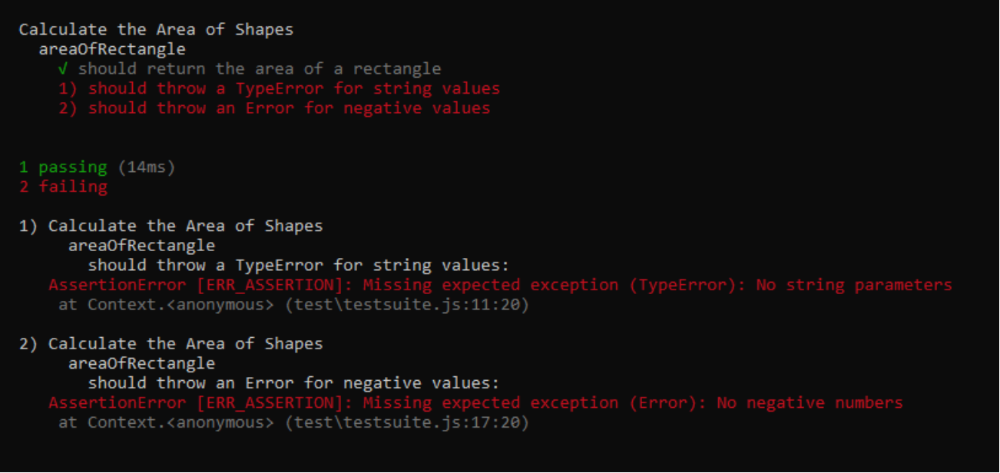
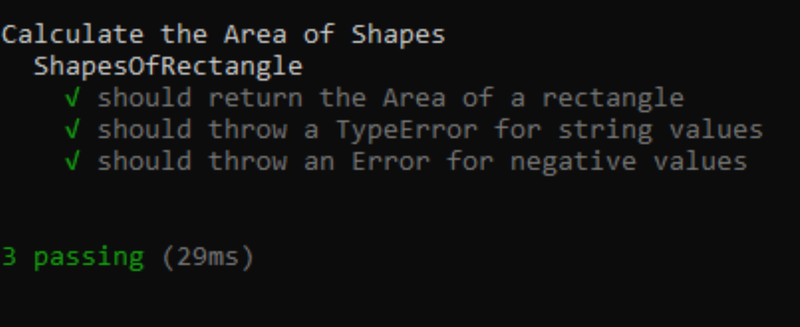
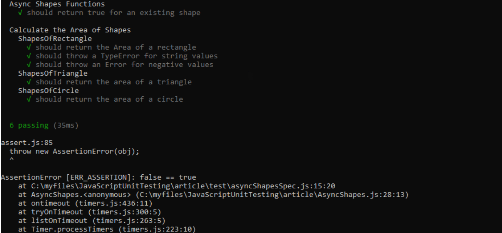
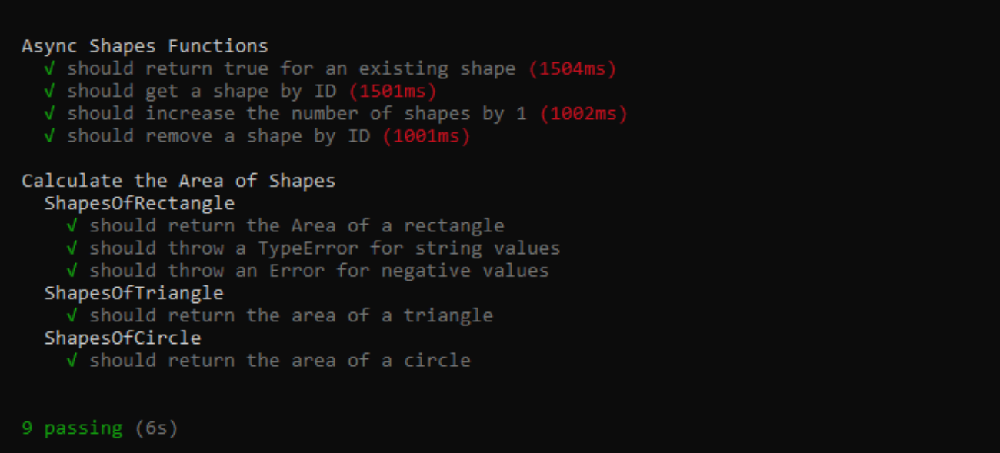

---

title: Unit testing in Javascript with mocha.js
date: 2019-08-20 00:00 UTC
author: Anne Essien
fa: fa-eye
summary_img: unit-testing-in-js-using-mocha/screen-options.jpg
tags: node, javacscript, mocha.js

---

It is common knowledge that lots of developers do not like to write unit tests for their software because it's a lot of additional work that feels like it should be optional. However, the utility of unit testing over meticulous eye-balling and manual checks for bugs cannot be overemphasized. This article is aimed at presenting a comprehensive but simplistic approach to unit testing for beginners who want to give [test-driven development](https://en.wikipedia.org/wiki/Test-driven_development) a try.

## Unit Testing

The source code of every application is made up of small individual units or components. [Unit testing](https://en.wikipedia.org/wiki/Unit_testing) is a software development process whereby every testable unit of the software is isolated and individually tested to ensure the validity of their respective output.

## The Mocha Framework

[Mocha](https://mochajs.org/) is the most widely used of several Javascript testing frameworks. It is arguably the most popular because it supports the testing of asynchronous code and runs on both [Node.js](https://nodejs.org) and the browser. This means you need to have node.js installed on your machine to use Mocha.

There are two ways to install mocha:

```
1. $ npm install --global mocha
2. $ npm install --save-dev mocha
```

With the globally installed mocha, you can run your test with `$ mocha`, while the dependency installation can be run with `$ ./node_modules/mocha/bin/mocha`.

## First steps to unit testing
Starting with synchronous logic, we want to write tests for a number of functions that calculate the area of shapes(i.e. rectangle, triangle and circle). We will validate our expectations using Node.js' built-in assert module. This will enable us to establish rules for the desired performance.

### Identify and define test expectations

Expectations for the function __areaOfRectangle()__ should include:

1. Calculates of the area of a rectangle correctly<span><b>: (3 * 8)</b> should equal <b>24.</b></span>
2. Only accepts integer values<span><b>: ('3' * '8')</b> throws an error</span>
3. Does not accept negative parameter values<span><b>: (-3 * 5)</b> throws an error.</span>

To define basic expectations for a test with Mocha, you have to make use of the __describe()__ and __it()__ functions as shown in the example below.

```
describe('#areaOfRectangle()', function() {

  it('should return the area of a rectangle', function() {
    function areaOfRectangle(width, height) {
      return width * height;
    }
    assert.equal(areaOfRectangle(3, 8), 24);
  });

});
```
__describe()__ - is a function that contains a collection of related tests. A test suite can be defined with nested <i>describe()</i> functions when there is a need for that.

__it()__ - is a function that is contained within <i>describe()</i>. It contains the name of an isolated test and a function that implements all the assertions for that test. <i>it()</i> can be regarded as a Spec.

__assert module__ - the success of failure of the test depends on this module because it determines what the output of a tested function should be.  

Now that we have both identified and defined test expectations, we will go ahead and write the test suite. 

Create a new folder named `unit-testing`. Inside the folder, create a new file and call it `Shapes.js`, then copy and paste the code below.

```js
// Shapes.js
class Shapes {
    areaOfRectangle(width, height) {
        return width * height;
    }
    areaOfTriangle(base, height) {
        return (base * height) / 2
    }
    areaOfCircle(radius) {
        let pi = 3.14;
        return (pi * (radius ** 2));
    }
}
module.exports = new Shapes();
```

Still within the `unit-testing` folder, create a sub-folder and specifically name it `'test'`. This is because mocha looks out for this directory to execute the test files in it. 

Within your `test` folder, create a `specs.js` file and type the following code. 

```js
// test/specs.js
 
const assert = require('assert');
const Shapes = require('../Shapes');
 
describe('Calculate the Area of Shapes', function() {
    describe('areaOfRectangle', function() {
        it('should return the area of a rectangle', function() {
            assert.equal(Shapes.areaOfRectangle(3, 8), 24);
        });
 
        it('should throw a TypeError for string values', function() {
            assert.throws(function() {
                Shapes.areaOfRectangle('6', '12')
            }, TypeError, 'No string parameters');
        });
 
        it('should throw an Error for negative values', function() {
            assert.throws(function() {
                Shapes.areaOfRectangle(-20, -12)
            }, Error, 'No negative numbers');
        });
    });
});
```
Navigate to the `unit-testing` directory via a terminal and run `$ mocha`. The test result should have only one out of the three test suites passing.


__<div align="center">1 passing spec and 2 failing specs</div>__

It is obvious from the test results that the function is not meeting expectations. The next thing to do is refactor the code to include the missing assertion errors so that all the test specs should pass. 

### Refactor Code

```js
// Shapes.js
 
class Shapes {
    areaOfRectangle(width, height) {
        if ((typeof width && typeof height) !== 'number') {
            throw new TypeError('Params must be a number.')
        }
        else if (width < 0 || height < 0){
            throw new Error('No negative numbers')
        }
        return width * height;
    }
 
    areaOfTriangle(base, height) {
        return (base * height) / 2
    }
 
    areaOfCircle(radius) {
        let pi = 3.14;
        return (pi * (radius ** 2));
    }
}
 
module.exports = new Shapes();
```

If we run the test again at this point, we will have three passing tests because we now have a function that performs as expected.


__<div align="center">3 passing specs</div>__

You can go ahead and add specs for the `areaOfTriangle()` and the `areaOfCircle()` functions following the same pattern.

```js
// test/specs.js
 
const assert = require('assert');
const Shapes = require('../Shapes');
 
describe('Calculate the Area of Shapes', function() {
    describe('areaOfRectangle', function() {
        it('should return the area of a rectangle', function() {
            assert.equal(Area.areaOfRectangle(3, 8), 24);
        });
 
        it('should throw a TypeError for string values', function() {
            assert.throws(function() {
                shapes.areaOfRectangle('6', '12')
            }, TypeError, 'No string parameters');
        });
 
        it('should throw an Error for negative values', function() {
            assert.throws(function() {
                shapes.areaOfRectangle(-20, -12)
            }, Error, 'No negative numbers');
        });
    });
 
    describe('areaOfTriangle', function() {
        it('should return the area of a triangle', function() {
            assert.equal(shapes.areaOfTriangle(3, 8), 12);
        });
    });
 
    describe('areaOfCircle', function() {
        it('should return the area of a circle', function() {
            assert.equal(shapes.areaOfCircle(8), 200.96);
        });
    });
});
```

## Unit tests for Asynchronous code

The asynchronicity of code allows program execution to handle other lined up processes while waiting for a pending output to be returned. [Asynchronous programming](https://eloquentjavascript.net/11_async.html) is applied with different approaches such as [Callbacks](https://javascript.info/callbacks), [Promises](https://javascript.info/promise-basics), and [Async/Await](https://javascript.info/async-await). The easiest way to present asynchrony in Javascript is by using the [setTimeout()](https://javascript.info/settimeout-setinterval) method to schedule delayed responses.

The unit testing process for asynchronous code is not any different from that of synchronous code. However, the emphasis is on the necessary precautions that should prevent your tests from completing before receiving the delayed responses.

Create a new file `AsyncShapes.js` and copy the code in the next snippet to it. It's a class with relatively simple asynchronous methods.

```js
// AsyncShapes.js
 
class AsyncShapes {
    constructor(shapesArray) {
        this.shapesArray = shapesArray;
    }
 
    validateShape(item, callback) {
        setTimeout(function() {
            callback(this.shapesArray.includes(item))
        }.bind(this), 1000);
    }
 
    getShape(id, callback) {
        if (id >= this.shapesArray.length) {
            throw new Error(`There is no shape with index ${id}`)
        }
        setTimeout(function() {
            callback(this.shapesArray[id]);
        }.bind(this), 1000)
    }
 
    addShape(item, callback) {
        setTimeout(function() {
            callback(this.shapesArray.push(item));
        }.bind(this), 3000)
    }
 
    removeShape(id, callback) {
        setTimeout(function() {
            callback(this.shapesArray.splice(id, 1));
        }.bind(this), 1000)
    }
}
 
module.exports.AsyncShapes = AsyncShapes;
```

Create another file `asyncSpecs.js` in the test folder and write the test suit for our async functions.

```js
// test/asyncSpecs.js
 
const assert = require('assert');
const asyncShapes = require('../AsyncShapes');
let list = ['Rectangle', 'Triangle', 'Circle', 'Trapezium'];
let shapesObj = new AsyncShapes(list);
  
describe('Async Shapes Functions', function() {
    it ('should validate an existing shape', function() {
        shapesObj.validateShape('Square', function(validShape) {
            assert.equal(validShape, true);
        });
    });
});
```

This test is not supposed to validate 'Square' as an existing shape. Yet surprisingly, the test will erroneously pass in the first instance. But after a while, it throws an AssertionError as seen below.


__<div align="center">A false passing test</div>__

When a test completes before the callback is returned, it treats the empty assertion as a positive result which gives a passing test. In this case, even though 'Square' is not included in the list, the test did not fail because the callback had not yet returned a false response.

To prevent the test framework from compromising test results by this behaviour, you should pass a `done` parameter to the function in your `it()`. You should also call `done()` after your assertion. This will compel the test to wait until the delayed response is received before it terminates. 

### An improved test suite for async class methods

Apart from the `done()` callback that was earlier mentioned, I'd like to bring in the simplest usage of the `beforeEach()` hook. It is one of several hooks named `before()`, `after()`, `beforeEach()`, and `afterEach()`. They are used to set up conditions that must be applied before or after every function as the case may be. In this case, the `beforeEach()` initialises constructor of the class AsyncShapes with an array of shapes.

```js
// test/asyncSpecs.js
 
const assert = require('assert');
let asyncShapes = require('../AsyncShapes.js');
let list = ['Rectangle', 'Triangle', 'Circle', 'Trapezium'];
let shapesObj;
 
beforeEach('Load Shapes Array', function(){
    shapesObj  = new asyncShapes.AsyncShapes(list)
});
  
describe('Async Shapes Functions', function() {
    it ('should return true for an existing shape', function(done) {
        shapesObj.validateShape('Circle', function(validShape) {
            assert.equal(validShape, true);
            done();
        });
    });
 
    it ('should get a shape by ID', function(done) {
        shapesObj.getShape(3, function(result) {
            assert.equal(result, 'Trapezium');
            done();
        });
    });
 
    it ('should increase the number of shapes by 1', function(done) {
        shapesObj.addShape('Parallelogram', function() {
            assert.equal(list.length, 5);
            done();
        });
    });
 
    it ('should remove a shape by ID', function(done) {
        shapesObj.removeShape(2, function() {
            assert.equal(list.length, 4);
            done();
        });
    });
})
```

So if we run the test at this point, the outcome will be a list of 9 passing specs from the two test files specs.js and asyncSpecs.js.


__<div align="center">9 passing specs</div>__


### Conclusion

Throughout the article, we only made use of barebones Mocha.js without any additional assertion libraries. It is by no means the only tool that's available for advanced testing. You should also look up how to use the [Chai assertion library](https://www.chaijs.com/) alongside Mocha to enjoy more classical assertion styles and chaining capabilities. 

You can also run your tests from your terminal using `$ npm test` instead of `$ mocha`.  For that command to work, you have to add the following script to your `package.json`:
```
"scripts": {
    "test": "mocha"
 }
 ```

Finally, Promises and Async/Await are both very important features in modern asynchronous Javascript programming. Although the scope of this article could not conveniently cover them, it is important to get acquainted with the way they work and how they are used instead of callbacks.
